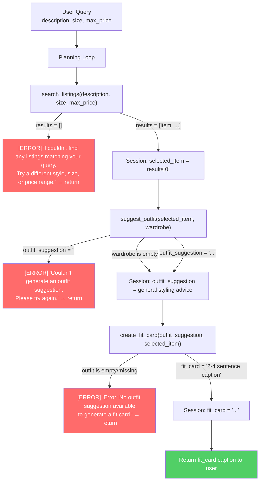

# FitFindr — planning.md

> Complete this document before writing any implementation code.
> Your spec and agent diagram are what you'll use to direct AI tools (Claude, Copilot, etc.) to generate your implementation — the more specific they are, the more useful the generated code will be.
> Your planning.md will be reviewed as part of your submission.
> Update it before starting any stretch features.

---

## Tools

List every tool your agent will use. For each tool, fill in all four fields.
You must have at least 3 tools. The three required tools are listed — add any additional tools below them.

### Tool 1: search_listings

**What it does:**
<!-- Describe what this tool does in 1–2 sentences -->
This tool searches through a list of secondhand clothing listings and returns matches based on the user's query. 

**Input parameters:**
<!-- List each parameter, its type, and what it represents -->
- `description` (str): Text describing what the user is looking for.(e.g. "Vintage baggie jeans")
- `size` (str): The user's size preference.(e.g. "M", "L")
- `max_price` (float): The user's maximum price preference.(e.g. "30.00")

**What it returns:**
<!-- Describe the return value — what fields does a result contain? -->
It returns a list of up to 3 listings sorted by relevance to the query. Each listing will be a dictionary with the following fields: id, title, description, category, style_tags (list), size, condition, price (float), colors (list), brand, platform

**What happens if it fails or returns nothing:**
<!-- What should the agent do if no listings match? -->
If no listings are found, it should return an empty list. It should not make any other tool calls. It should instead tell the user that no listings were found and ask for a different query.
---

### Tool 2: suggest_outfit

**What it does:**
<!-- Describe what this tool does in 1–2 sentences -->
This tool suggests 1-2 complete outfits using the new item and the user's wardrobe.

**Input parameters:**
<!-- List each parameter, its type, and what it represents -->
- `new_item` (dict): The new item that the user is considering buying. It contains the following fields: id, title, description, category, style_tags (list), size, condition, price (float), colors (list), brand, platform
- `wardrobe` (dict): The user's wardrobe. It contains the following fields: id, title, description, category, style_tags (list), size, condition, price (float), colors (list), brand, platform

**What it returns:**
<!-- Describe the return value -->
A string with outfit suggestions based on the new item and the user's wardrobe. If the wardrobe is empty, it will suggest general styling advice for the item rather than raising an exception or returning an empty string. 

**What happens if it fails or returns nothing:**
<!-- What should the agent do if the wardrobe is empty or no outfit can be suggested? -->
If the wardrobe is empty, it will suggest general styling advice for the item rather than raising an exception or returning an empty string. If it can't suggest an outfit for any other reason, it should return an empty string and the agent should try again.
---

### Tool 3: create_fit_card

**What it does:**
<!-- Describe what this tool does in 1–2 sentences -->
This tool generates a short, shareable outfit caption for the thrifted find.

**Input parameters:**
<!-- List each parameter, its type, and what it represents -->
- `outfit` (str): The outfit suggestion from suggest_outfit(). 
- `new_item` (dict): The new item that the user is considering buying. It contains the following fields: id, title, description, category, style_tags (list), size, condition, price (float), colors (list), brand, platform

**What it returns:**
<!-- Describe the return value -->
A string with a 2-4 sentence outfit caption. The caption should feel casual and authentic (like a real OOTD post, not a product description), mention the item name, price, and platform naturally (once each), capture the outfit vibe in specific terms, and sound different each time for different inputs (use higher LLM temperature)

**What happens if it fails or returns nothing:**
<!-- What should the agent do if the outfit data is incomplete? -->
If the outfit is empty or missing, it should return an error message rather than raising an exception or returning an empty string.
---

### Additional Tools (if any)

<!-- Copy the block above for any tools beyond the required three -->

---

## Planning Loop

**How does your agent decide which tool to call next?**
<!-- Describe the logic your planning loop uses. What does it look at? What conditions change its behavior? How does it know when it's done? -->

* Describe the logic your planning loop uses:
  - The user starts with a query.
  - The agent calls search_listings() with the user's query.
  - After search_listings runs, check if results is empty. If yes, set an error message in the session and return early. If no, set selected_item = results[0] and proceed to suggest_outfit.
  - The agent then calls suggest_outfit() with the new item and the user's wardrobe.
  - After suggest_outfit runs, check if the response is empty or an error. If yes, set an error message in the session and return early. If no, proceed to create_fit_card.
  - Finally, the agent calls create_fit_card() with the outfit suggestion and the new item.
  - After create_fit_card runs, check if the response is empty or an error. If yes, set an error message in the session and return early. If no, proceed to return the outfit suggestion and the outfit caption to the user.

* What does it look at?
  - It looks at the user's query, the new item, and the user's wardrobe.
  - It also looks at the output of each tool call.

* What conditions change its behavior?
  - If the search_listings() tool returns an empty list, the agent will stop and not call any other tools and ask the user for a different query.
  - If the suggest_outfit() tool returns an empty string, the agent will give a general styling advice for the item instead.
  - If the create_fit_card() tool returns an error message (i.e., fit_card starts with 'Error:'), the agent sets error_message in the session and returns early without showing any caption.

* How does the agent know when it's done?
  - The agent is done when it has returned a outfit suggestion and a outfit caption.
  - The agent is done if it doesn't have any more tools to call.
---

## State Management

**How does information from one tool get passed to the next?**
<!-- Describe how your agent stores and accesses state within a session. What data is tracked? How is it passed between tool calls? -->

* Describe how your agent stores and accesses state within a session. What data is tracked?
    - `user_query` (str): The original user input (e.g., "vintage graphic tee under $30").
    - `selected_item` (dict): Set to `results[0]` after `search_listings()` succeeds. Contains fields: id, title, description, category, style_tags, size, condition, price, colors, brand, platform.
    - `outfit_suggestion` (str): Set to the return value of `suggest_outfit()`. Contains 1–2 outfit ideas referencing named wardrobe pieces (or general advice if wardrobe is empty).
    - `fit_card` (str): Set to the return value of `create_fit_card()`. A 2–4 sentence Instagram/TikTok-style caption.
    - `error_message` (str | None): Set to a descriptive string if any tool fails; triggers an early return and is shown to the user.

* How is it passed between tool calls?
    - After `search_listings()` → `selected_item = results[0]` is stored in session and passed as `new_item` to `suggest_outfit()`.
    - After `suggest_outfit()` → `outfit_suggestion` is stored in session and passed as `outfit` to `create_fit_card()`.
    - After `create_fit_card()` → `fit_card` is stored in session and returned to the user as the final response.
    - If any step sets `error_message`, no further tool calls are made and `error_message` is returned instead.

---

## Error Handling

For each tool, describe the specific failure mode you're handling and what the agent does in response.

| Tool | Failure mode | Agent response |
|------|-------------|----------------|
| search_listings | No results match the query | I couldn't find any listings matching '[query]'. Try a different style, size, or price range. |
| suggest_outfit | Wardrobe is empty | Return general styling advice for the item: "This [item category] pairs well with [complementary items]. Here are some styling ideas: ..." |
| create_fit_card | Outfit input is missing or incomplete | Error: No outfit suggestion available to generate a fit card. |

---

## Architecture

<!-- Draw a diagram of your agent showing how the components connect:
     User input → Planning Loop → Tools (search_listings, suggest_outfit, create_fit_card)
                                                                          ↕
                                                                   State / Session
     Show what triggers each tool, how state flows between them, and where error paths branch off.
     ASCII art, a Mermaid diagram (https://mermaid.js.org/syntax/flowchart.html), or an embedded
     sketch are all fine. You'll share this diagram with an AI tool when asking it to implement
     the planning loop and each individual tool. -->



---

## AI Tool Plan

<!-- For each part of the implementation below, describe:
     - Which AI tool you plan to use (Claude, Copilot, ChatGPT, etc.)
     - What you'll give it as input (which sections of this planning.md, your agent diagram)
     - What you expect it to produce
     - How you'll verify the output matches your spec before moving on

     "I'll use AI to help me code" is not a plan.
     "I'll give Claude my Tool 1 spec (inputs, return value, failure mode) and ask it to implement
     search_listings() using load_listings() from the data loader — then test it against 3 queries
     before trusting it" is a plan. -->

* Which AI tool you plan to use (Claude, Copilot, ChatGPT, etc.)
    - I plan to use Claude to help me implement the tools.

* What you'll give it as input (which sections of this planning.md, your agent diagram)
    - For search_listings, I'll give Claude the Tool 1 block from planning.md (inputs, return value, failure mode) and ask it to implement the function using load_listings() from the data loader. Before running it, I'll check that the generated code filters by all three parameters and handles the empty-results case. Then I'll test it with 3 queries.

    - For suggest_outfit, I'll give Claude the Tool 2 block from planning.md (inputs, return value, failure mode) and ask it to implement the function suggest_outfit() using the output from the search_listings() tool. Before running it, I'll check that the generated code handles the empty-wardrobe case as specified. Then I'll test it with both an empty and a non-empty wardrobe.

    - For create_fit_card, I'll give Claude the Tool 3 block from planning.md (inputs, return value, failure mode) and ask it to implement the function create_fit_card() using the output from the suggest_outfit() tool. Before running it, I'll check that the generated code handles empty/whitespace outfit strings as specified. Then I'll test it with a real outfit string and a known-bad empty string.

* What you expect it to produce
    - I expect search_listings() to produce a non-empty list of matching listings, sorted by relevance.
    - I expect suggest_outfit() to produce a outfit suggestion.
    - I expect create_fit_card() to produce a 2-4 sentence string usable as an Instagram/TikTok caption.

* How you'll verify the output matches your spec before moving on
    - I'll run each tool with different inputs and check if the output matches my spec.

**Milestone 3 — Individual tool implementations:**
- I'll give Claude the Tool 1 spec block (inputs, return value, failure mode) + the `load_listings()` data loader signature, and ask it to implement `search_listings()` in `tools.py`. I'll verify by running 3 test queries: one that returns results, one where no size matches, and one where price filters everything out.

- I'll give Claude the Tool 2 spec block and ask it to implement `suggest_outfit()` using the Groq client. I'll verify by testing with an empty wardrobe (expect general advice) and a populated wardrobe (expect named outfit combinations).

- I'll give Claude the Tool 3 spec block and ask it to implement `create_fit_card()` using the Groq client at higher temperature. I'll verify by testing with a real outfit string and an empty string — the latter must return an error message, not raise an exception.

**Milestone 4 — Planning loop and state management:**
- I'll give Claude the Planning Loop section + the architecture diagram from planning.md, and ask it to implement `run_agent()` in `agent.py`. 

- I'll verify by tracing a known query through manually: confirm `selected_item` is set after step 1, `outfit_suggestion` after step 2, `fit_card` after step 3. 

- I'll also test that an empty `search_listings` result stops execution without calling `suggest_outfit` or `create_fit_card`.

---

## A Complete Interaction (Step by Step)

Write out what a full user interaction looks like from start to finish — tool call by tool call. Use a specific example query.

**Example user query:** "I'm looking for a vintage graphic tee under $30. I mostly wear baggy jeans and chunky sneakers. What's out there and how would I style it?"

* 2–3 sentence description of what FitFindr needs to do. Include what triggers each tool and what happens when something fails.
It should first use the search_listings tool to find vintage graphic tees under $30 that match the user's style. Then it should use the suggest_outfit tool to suggest an outfit using the found tee and the user's existing wardrobe. Finally, it should use the create_fit_card tool to create a fit card showing the outfit. If any tool fails, it should try again or ask the user for more information.

**Step 1:**
<!-- What does the agent do first? Which tool is called? With what input? -->
* What does the agent do first?
   - It parse the user's request and uses the search_listings tool to find vintage graphic tees under $30 that match the user's style.

* Which tool is called?
   - search_listings tool

* With what input?
   - "vintage graphic tee", "M", "$30"

**Step 2:**
<!-- What happens next? What was returned from step 1? What tool is called now? -->
* What happens next?
   - It uses the suggest_outfit tool to suggest an outfit using the found tee and the user's existing wardrobe.

* What was returned from step 1?
   - A list of matching listings, sorted by relevance.

    ```json
    [
      {
        "id": "listing_001",
        "title": "Vintage 90s Nike Graphic Tee",
        "description": "Classic 90s Nike tee with bold graphic print. Perfect for a retro look.",
        "category": "Tops",
        "style_tags": ["vintage", "90s", "streetwear", "casual"],
        "size": "M",
        "condition": "Excellent",
        "price": 25.00,
        "colors": ["white", "blue"],
        "brand": "Nike",
        "platform": "Depop"
      }
    ]
    ```

* What tool is called now?
   - suggest_outfit tool

* With what input?
   - new item listing from step 1, user's wardrobe

**Step 3:**
<!-- Continue until the full interaction is complete -->
* What happens next?
   - It uses the create_fit_card tool to generate a caption for the outfit.

* What was returned from step 2?
   - A outfit suggestion based on the new item and the user's wardrobe.

    ```json
    "outfit_suggestion": "Here’s a killer outfit for your new tee:\n\n**The Fit:**\n- **Top:** Your vintage 90s Nike graphic tee (the star of the show!)\n- **Bottoms:** Black baggy cargo pants (ties into the 90s vibe)\n- **Shoes:** Chunky white sneakers\n- **Accessories:** Silver chain necklace + beanie\n\n**Vibe:** Effortless streetwear cool. This look nails that casual, vintage skater aesthetic while keeping the focus on your awesome tee."
    ```

* What tool is called now?
   - create_fit_card tool

* With what input?
   - outfit suggestion from step 2, new item listing from step 1

**Final output to user:**
<!-- What does the user actually see at the end? -->
- The user sees the caption for the outfit.

```json
"final_output": "Obsessed with this find! Snagged this vintage 90s Nike graphic tee for just $25 on Depop, and it’s already my new fave. Styling it with some baggy cargo pants and fresh sneakers for that perfect laid-back streetwear vibe."
```

Example query that would cause each tool to fail and the expected behavior:

* search_listings:
   - User searches for an item that is not in the listings data.
   - Expected behavior: Returns an empty list.

* suggest_outfit:
   - User searches for an item that is not in the listings data.
   - Expected behavior: Returns a message indicating that the item is not in the listings data.

* create_fit_card:
   - User searches for an item that is not in the listings data.
   - Expected behavior: Returns a message indicating that the item is not in the listings data.
